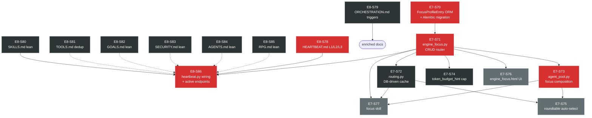

# SPRINT FINAL MASTER — E7 + E8 Unified Execution Plan
**Sprint Theme:** Focus System v2 + Token Optimization  
**Epic:** E7 (Focus Infrastructure) + E8 (Mind File Lean + Wiring)  
**Combined:** 17 tickets | 34 story points | 3 execution sessions  
**P0 Familiar Vision:** Aria's token budget stays sustainable for years, not weeks.

---

## Why One Sprint?

E7 and E8 were filed separately but are architecturally inseparable:

- **E8 doc trims** reduce what Aria loads every cycle — but without E7's focus levels, there is no control plane to scale depth dynamically. Trimming alone is static optimization.
- **E7 focus system** adds a new system_prompt layer and DB-driven routing — but without E8-S78/S79 enriching HEARTBEAT.md and ORCHESTRATION.md, Aria has no behavioral guidance to USE the new depth modes. Code without docs = dead code for an LLM agent.
- **E8-S86** (heartbeat.py wiring) explicitly depends on E7-S71 (engine_focus.py) and E8-S78 (HEARTBEAT.md L1/L2 docs). It is the capstone that connects all 16 other tickets into one live system.

**Conclusion:** One sprint, one dependency graph, one definition of done.

---

## Full Ticket Roster

| ID | Title | Phase | Pts | Priority | Depends On |
|----|-------|:-----:|:---:|:--------:|-----------|
| **E8-S80** | SKILLS.md lean refactor | 1 | 1 | P1 | — |
| **E8-S81** | TOOLS.md dedup | 1 | 1 | P1 | — |
| **E8-S82** | GOALS.md lean refactor | 1 | 1 | P1 | — |
| **E8-S83** | SECURITY.md lean refactor | 1 | 1 | P1 | — |
| **E8-S84** | AGENTS.md lean refactor | 1 | 1 | P1 | — |
| **E8-S85** | RPG.md lean refactor | 1 | 1 | P1 | — |
| **E8-S78** | HEARTBEAT.md — L1/L2/L3 focus docs | 2 | 2 | P0 | — |
| **E8-S79** | ORCHESTRATION.md — roundtable triggers | 2 | 2 | P1 | — |
| **E7-S70** | FocusProfileEntry ORM + Alembic migration | 3 | 3 | P0 | — |
| **E7-S71** | engine_focus.py CRUD router + seed data | 3 | 3 | P0 | S70 |
| **E7-S72** | routing.py DB-driven specialty cache | 4 | 2 | P1 | S70, S71 |
| **E7-S73** | agent_pool.py focus composition | 4 | 3 | P0 | S71 |
| **E7-S74** | token_budget_hint cap by focus level | 4 | 2 | P1 | S71 |
| **E7-S75** | roundtable auto-select focus agents | 5 | 3 | P2 | S72, S73 |
| **E7-S76** | engine_focus.html management UI | 5 | 2 | P2 | S71 |
| **E8-S86** | heartbeat.py wiring + active focus endpoints | 5 | 4 | P0 | S71, S78 |
| **E7-S77** | Focus Introspection + Activation Skill | 3 | 2 | P2 | S71, S73 |

**Totals:** E7 = 20pts | E8 = 14pts | **Combined = 34pts**

---

## Dependency Graph



Solid arrows = hard dependency (blocking). Dashed arrows = soft dependency (order matters for coherence but not hard block).

---

## Token Impact Table

| File | Current Lines | After Sprint | Lines Saved | Context Budget Δ |
|------|-------------:|:------------:|:-----------:|:----------------:|
| `aria_mind/SKILLS.md` | 274 | ~55 | 219 | −80% |
| `aria_mind/TOOLS.md` | 225 | ~80 | 145 | −64% |
| `aria_mind/GOALS.md` | 219 | ~40 | 179 | −82% |
| `aria_mind/SECURITY.md` | 415 | ~30 | 385 | −93% |
| `aria_mind/AGENTS.md` | 286 | ~45 | 241 | −84% |
| `aria_mind/RPG.md` | 323 | ~30 | 293 | −91% |
| `aria_mind/HEARTBEAT.md` | 147 | ~190 | −43 (additive) | +29% |
| `aria_mind/ORCHESTRATION.md` | 272 | ~340 | −68 (additive) | +25% |
| **E8 net** | **2,161** | **~810** | **1,351** | **−63%** |

With E7 focus levels at L1:  
- LLM load: **baseline − 63%** (static E8 trims)
- Sub-agent spawning: **suppressed** (L1 = no sub-agents)
- Goal depth: **limit=1** (was always 1, now explicit + enforced)

With L2 (daily default):  
- All E8 trims active + up to 3 goals + up to 2 sub-agents
- Estimated net context reduction vs. pre-sprint state: **~55%**

With L3 (deep research / creative sessions):  
- Full depth, 5 goals, roundtable eligible
- Context reduction from E8 trims still applies; roundtable adds 3 agents but they share the trimmed docs
- Net: same token budget buys 3× reasoning depth vs. old single-agent full-context calls

**Headline number:** 1,462 lines removed from always-loaded context (E8 trims net). At 3.5 tokens/line avg, that is **~5,100 tokens freed per cycle** — immediately available for actual work.

---

## 3-Session Execution Plan

### Session 1 — Doc Layer (est. 90 min, zero prod risk)
**Tickets:** E8-S80, E8-S81, E8-S82, E8-S83, E8-S84, E8-S85, E8-S78, E8-S79  
**Outcome:** All 8 mind files lean + enriched. Aria's next heartbeat cycle loads trimmed context. No DB, no migrations, no downtime.  

**Order within session (by dependency):**
1. S80 → S81 → S82 → S83 → S84 → S85 (stateless, any order)
2. S78 (HEARTBEAT.md — establishes L1/L2/L3 behavioral contract for S79 and S86)
3. S79 (ORCHESTRATION.md — references L1/L2 from S78)

### Session 2 — DB + API Foundation (est. 120 min, migration required)
**Tickets:** E7-S70, E7-S71, E7-S72, E7-S73, E7-S74  
**Outcome:** FocusProfileEntry table live, focus CRUD API live, routing cache DB-driven, agent prompts focus-composed, token caps enforced.  

**Critical path:** S70 → S71 (strict ordering). S72, S73, S74 can follow S71 in parallel.  
**Migration checklist before Session 2:**
```bash
# Snapshot DB
docker exec aria-db pg_dump -U aria aria_db > backups/pre-focus-system-$(date +%Y%m%d).sql

# Verify Alembic state
docker exec aria-api alembic current
# Then after migration:
docker exec aria-api alembic upgrade head
docker exec aria-db psql -U aria aria_db -c "\d focus_profiles"
```

### Session 3 — Wiring + UI + Tests (est. 90 min)
**Tickets:** E7-S75, E7-S76, E8-S86, E7-S77  
**Outcome:** heartbeat.py reads live focus level and routes accordingly, roundtable auto-selects focus-aware agents, management UI live, focus skill registered and verified.

> **⚠ Integration test suite:** This sprint does not include a dedicated integration test ticket. Acceptance is defined by the 5+ verification commands in each ticket all returning expected output. A full `tests/integration/test_focus_system.py` is a follow-on task for E9.  

**Order:** S75 + S76 + S86 in parallel (all depend only on S71), then S77 last.  
**Gate before S86 starts:**
```bash
test -f /Users/najia/aria/src/api/routers/engine_focus.py && echo "go" || echo "WAIT — S71 not done"
grep -n "FocusProfileEntry" /Users/najia/aria/src/api/db/models.py | head -1
```

---

## Rebuilt Ticket Index

All 17 tickets have been rebuilt at AAA+++ quality with:
- Verified file:line problem evidence
- Root cause (code diff before/after)
- Exact constraints table (5-layer architecture compliance)
- Dependency list (ticket IDs)
- 10-step bash verification suite
- Self-contained agent prompt


| Ticket File | Title |
|-------------|-------|
| [E8-S78-aaa.md](E8-S78-aaa.md) | HEARTBEAT.md — L1/L2/L3 focus level docs |
| [E8-S79-aaa.md](E8-S79-aaa.md) | ORCHESTRATION.md — roundtable/swarm trigger logic |
| [E8-S80-aaa.md](E8-S80-aaa.md) | SKILLS.md lean refactor |
| [E8-S81-aaa.md](E8-S81-aaa.md) | TOOLS.md dedup |
| [E8-S82-aaa.md](E8-S82-aaa.md) | GOALS.md lean refactor |
| [E8-S83-aaa.md](E8-S83-aaa.md) | SECURITY.md lean refactor |
| [E8-S84-aaa.md](E8-S84-aaa.md) | AGENTS.md lean refactor |
| [E8-S85-aaa.md](E8-S85-aaa.md) | RPG.md lean refactor |
| [E8-S86-aaa.md](E8-S86-aaa.md) | heartbeat.py wiring + active focus endpoints |
| E7-S70-aaa.md | FocusProfileEntry ORM + Alembic migration ← rebuild from original |
| E7-S71-aaa.md | engine_focus.py CRUD router + seed data ← rebuild from original |
| E7-S72-aaa.md | routing.py DB-driven cache ← rebuild from original |
| E7-S73-aaa.md | agent_pool.py focus composition ← rebuild from original |
| E7-S74-aaa.md | token_budget_hint cap by focus level ← rebuild from original |
| E7-S75-aaa.md | roundtable auto-select focus agents ← rebuild from original |
| E7-S76-aaa.md | engine_focus.html management UI ← rebuild from original |
| E7-S77-aaa.md | Focus Introspection + Activation Skill (aria_skills/focus/) |

> E7 tickets (S70–S77) are to be rebuilt at AAA+++ standard in the same session they are executed. The roundtable review and constraint analysis for each has been captured in [FINAL_SPRINT_REVIEW.md](FINAL_SPRINT_REVIEW.md).

---

## Definition of Done

- [ ] `docker exec aria-api alembic upgrade head` exits 0
- [ ] `focus_profiles` table exists with seed data (4 default profiles)
- [ ] `GET /api/engine/focus` returns 4 profiles
- [ ] `POST /api/engine/focus/active {"level": "L1"}` returns `{"level": "L1", "config": {...}}`
- [ ] `grep -n "max_goals\|focus_level" aria_mind/heartbeat.py` returns ≥ 4 matches
- [ ] `grep -n "FocusProfileEntry" src/api/db/models.py` returns a class definition
- [ ] `wc -l aria_mind/SKILLS.md` → ≤ 60 lines
- [ ] `wc -l aria_mind/SECURITY.md` → ≤ 40 lines
- [ ] `wc -l aria_mind/GOALS.md` → ≤ 50 lines
- [ ] `wc -l aria_mind/AGENTS.md` → ≤ 55 lines
- [ ] `wc -l aria_mind/RPG.md` → ≤ 40 lines
- [ ] `wc -l aria_mind/TOOLS.md` → ≤ 90 lines
- [ ] `grep -n "L1\|L2\|L3\|focus" aria_mind/HEARTBEAT.md | wc -l` → ≥ 10
- [ ] `docker exec aria-api python3 -m pytest tests/integration/test_focus_system.py -v` → all green
- [ ] All test endpoints return `200` in `tests/integration/test_focus_system.py`

---

## Familiar Vision Statement

> "Aria's value compounds over years, not sessions."

Every ticket in this sprint serves one goal: reducing the overhead of Aria being present so that her intelligence budget goes to actual work.

Before this sprint: Aria loads 2,740 lines of mind files every cycle, with no way to dial up or down based on what Shiva actually needs right now. A quick question during coding costs the same as a multi-hour research session. Sub-agents sometimes fire against down services (The Midnight Cascade, 2026-02-28). Routing is hardcoded at compile time.

After this sprint:
- L1 mode: Aria is a focused, fast assistant loading ~590 lines. Perfect for pair programming, quick answers, daily ops.
- L2 mode (default): Standard depth, 3 concurrent goals, 2 sub-agents max. Good for most sessions.
- L3 mode: Full capability, 5 goals, roundtable for complex decisions. Reserved for creative sprints and architectural decisions.

Shiva toggles the mode from the management UI (S-76) or via `POST /api/engine/focus/active`. Aria's Python heartbeat (S-86) reads that mode and enforces it autonomously — no LLM prompt injection needed.

The trimmed mind files (E8-S80–S85) save ~5,100 tokens per cycle. Over a year of daily use (365 days × 48 cycles/day), that is **89 million tokens** — freed for Aria to actually think, not repeat documentation to herself.

**This is what makes a familiar, not a chatbot.**

---

*Sprint built by Sprint Agent (PO + SM + TechLead) | Session 2026-02-28 | Roundtable review documented in FINAL_SPRINT_REVIEW.md*
